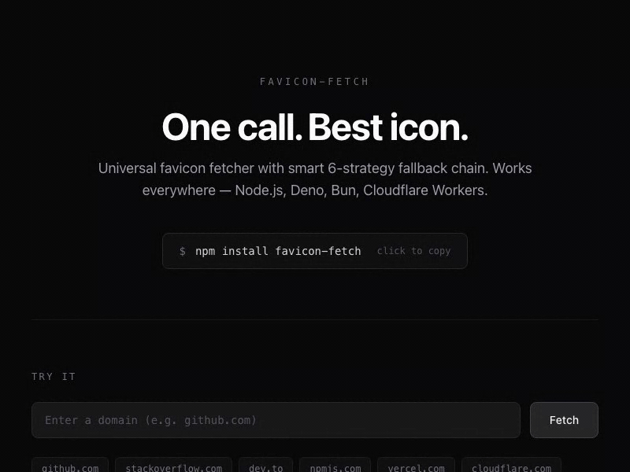

<p align="center"></p>

<h1 align="center">favicon-fetch</h1>

<p align="center">
  Universal favicon fetcher with smart fallback chain.<br/>
  One call, best icon, works everywhere.
</p>

<p align="center">
  <a href="https://www.npmjs.com/package/favicon-fetch"></a>
  
  
</p>

<p align="center">
  <a href="https://favicon-fetch.mulkatz.dev"><strong>Live Demo</strong></a>
</p>

<p align="center">
  
</p>

## Why favicon-fetch?

- **Smart fallback chain**: Tries 6 strategies in order until it finds the best icon
- **One call API**: `getFavicon(url)` returns the single best icon. Done.
- **Edge-first**: Works in Node.js, Deno, Bun, Cloudflare Workers — uses only `fetch()`
- **Zero dependencies**: No Puppeteer, no heavy parsers
- **Rich metadata**: Returns URL, source strategy, MIME type, width/height
- **Customizable**: Pick your strategies, set timeouts, bring your own fetch

## Install

```bash
npm install favicon-fetch
```

## Quick Start

```ts
import { getFavicon, getAllFavicons } from "favicon-fetch";

// Get the single best icon
const icon = await getFavicon("https://github.com");
// => { url: "https://github.com/fluidicon.png", source: "html-link", type: "image/png" }

// Get all discovered icons, sorted by quality
const icons = await getAllFavicons("https://github.com");
// => [{ url: "...", source: "html-link", width: 192 }, ...]
```

## Fallback Chain

Strategies are tried in order. The first to return results wins for `getFavicon`. `getAllFavicons` runs all and deduplicates.

| # | Strategy | What it does |
|---|----------|-------------|
| 1 | **HTML `<link>`** | Parses `<link rel="icon">`, `apple-touch-icon`, etc. |
| 2 | **Web Manifest** | Extracts icons from `manifest.json` |
| 3 | **Default Paths** | Tries `/favicon.ico`, `/favicon.png`, `/apple-touch-icon.png` |
| 4 | **Open Graph** | Falls back to `og:image` / `twitter:image` meta tags |
| 5 | **Google API** | Google's undocumented favicon service |
| 6 | **DuckDuckGo API** | DuckDuckGo's icon service |

## Icon Scoring

Icons are scored and sorted by quality:

- **SVG** > **PNG** > **ICO** (format preference)
- Larger dimensions score higher
- Direct source (HTML, manifest) scores higher than API fallbacks
- `getFavicon` returns the highest-scoring icon

## Options

```ts
const icon = await getFavicon("https://example.com", {
  // Request timeout in ms (default: 5000)
  timeout: 3000,

  // Which strategies to use (default: all 6)
  strategies: ["html-link", "default-path", "google-api"],

  // Custom fetch function (for proxies, auth headers, etc.)
  fetch: myCustomFetch,

  // Custom headers
  headers: { "Authorization": "Bearer ..." },
});
```

## API

### `getFavicon(url, options?)`

Returns a `Promise<FaviconResult | null>` — the single best favicon.

### `getAllFavicons(url, options?)`

Returns a `Promise<FaviconResult[]>` — all discovered favicons sorted by quality.

### `FaviconResult`

```ts
interface FaviconResult {
  url: string;
  source: "html-link" | "web-manifest" | "default-path" | "open-graph" | "google-api" | "duckduckgo-api";
  type?: string;    // e.g. "image/png", "image/svg+xml"
  width?: number;
  height?: number;
}
```

## License

MIT
